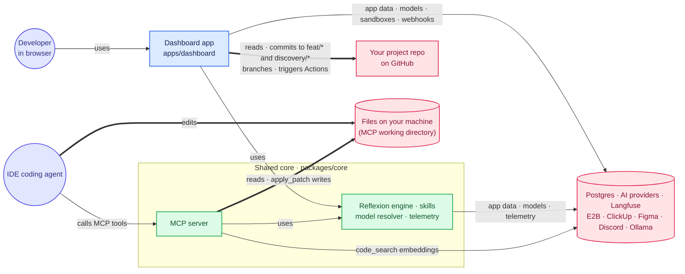
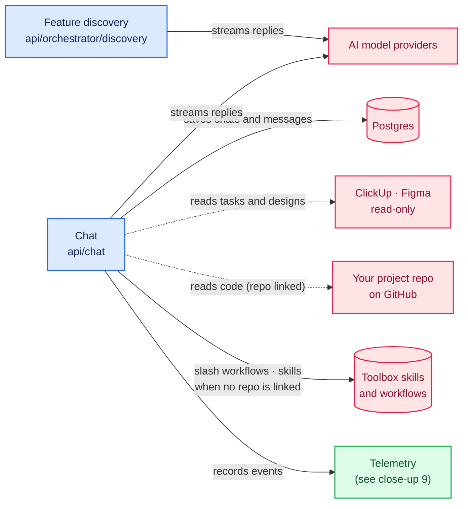
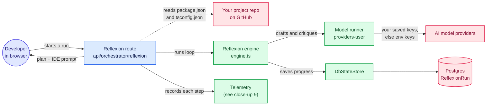
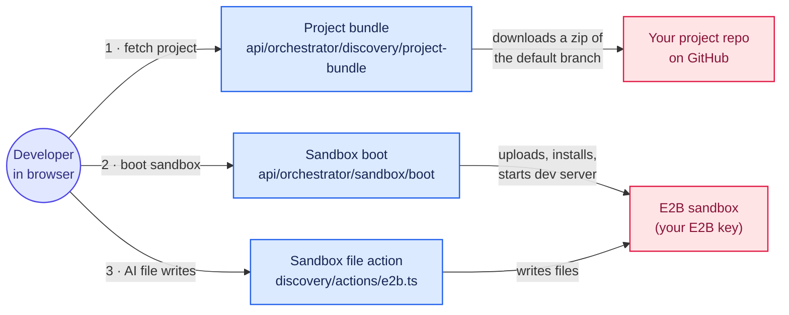
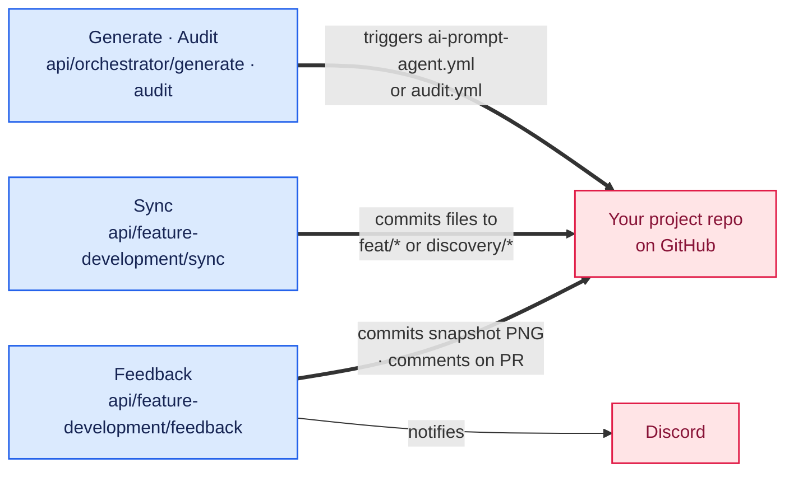
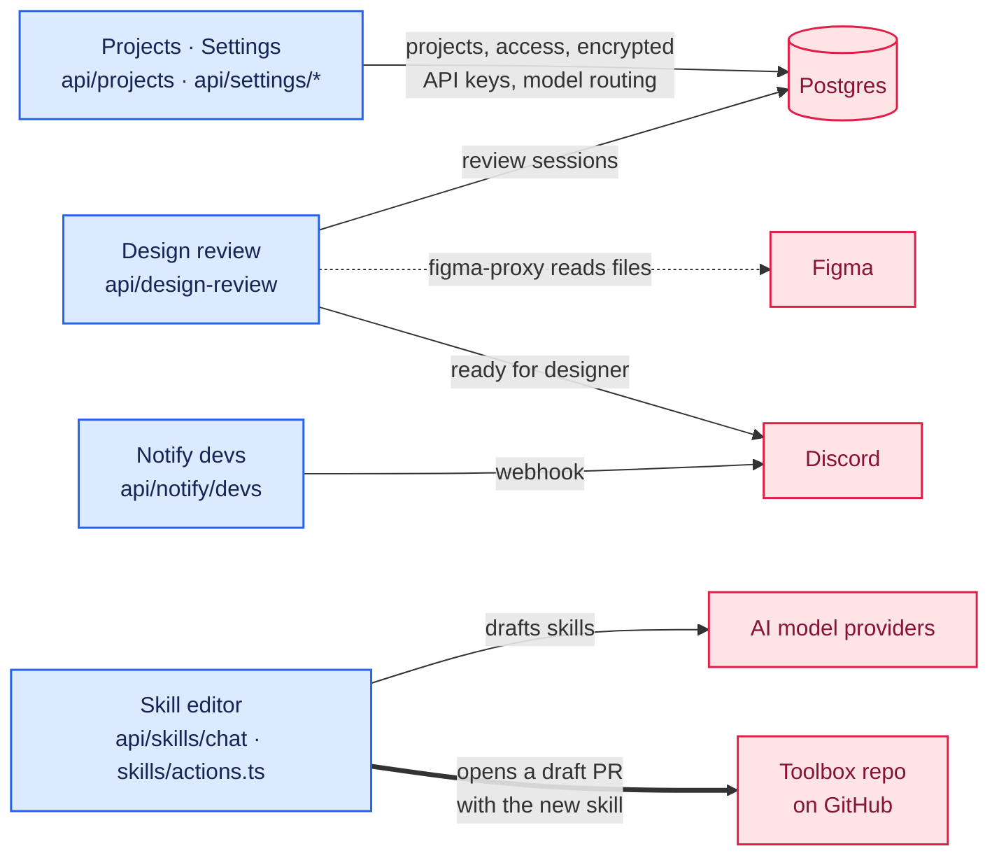
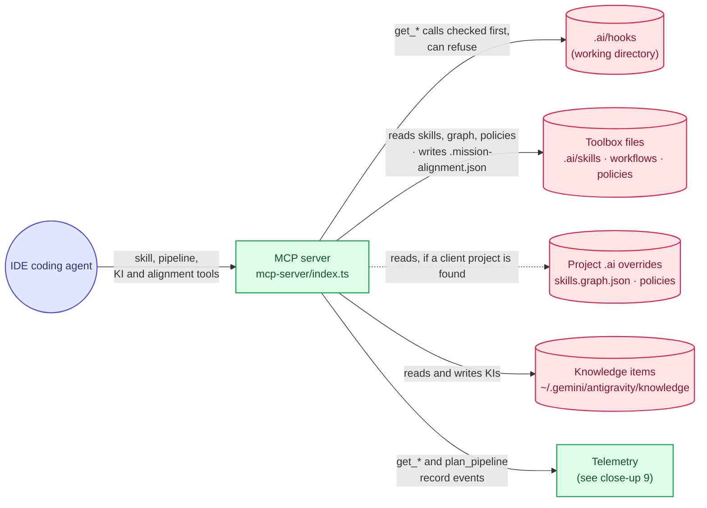
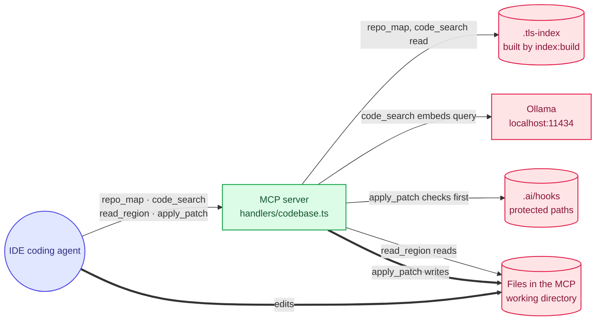
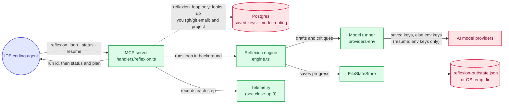
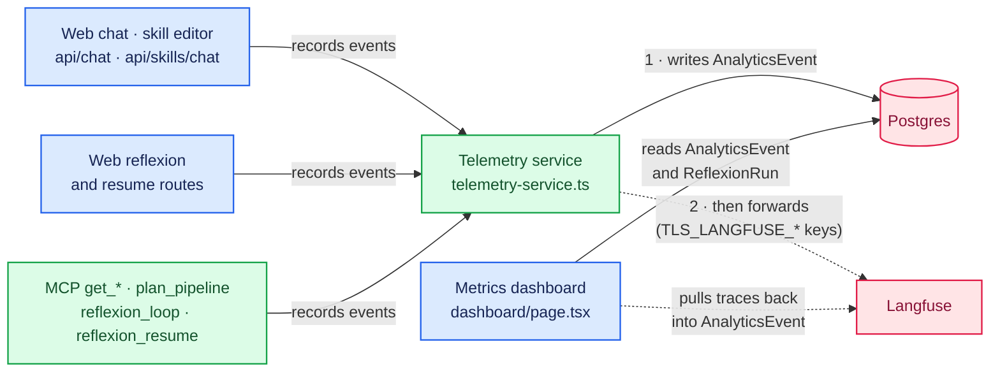

# The Lead Stack: Agent-Agnostic Workflows

### `intent-brief → spec → plan → diff → review-report → release`

[](https://github.com/bronz3beard/ai.tech-lead-stack/actions/workflows/ci.yml)
[](https://github.com/bronz3beard/ai.tech-lead-stack/actions/workflows/codeql.yml)
[](https://scorecard.dev/viewer/?uri=github.com/bronz3beard/ai.tech-lead-stack)
[](LICENSE)
[](package.json)
[](docs/skills.md)
[](docs/running-the-mcp-server.md)
[](#supported-editors--agents)
[](https://github.com/bronz3beard/ai.tech-lead-stack/commits/main)
[](https://github.com/bronz3beard/ai.tech-lead-stack/discussions)
[](CONTRIBUTING.md)

A high-performance repository of "Skills" and RTK-powered tools designed for
Tech Leads. These workflows are **Agent-Agnostic**, allowing any LLM agent
(Gemini, Claude, GPT) to assist with implementation planning, code review, and
automated testing.

Live Web App:
[https://ai-tech-lead-stack.vercel.app](https://ai-tech-lead-stack.vercel.app)

## Contents

- [How it fits together](#how-it-fits-together)
- [Commands Quick Reference](#commands-quick-reference)
- [Which tier am I on?](#which-tier-am-i-on)
- [Requirements](#requirements)
- [🚀 Quick Start](#-quick-start)
- [Supported Editors & Agents](#supported-editors--agents)
- [🧹 Resetting a Project](#-resetting-a-project)
- [Documentation](#documentation): setup guides, the skill and workflow
  catalogues, methodology and architecture
- [Peripherals & Sibling Apps](#peripherals--sibling-apps)
- [Branching Strategy](#branching-strategy)

<br />

### How it fits together

There are two ways in: the web dashboard and your IDE's coding agent. Both use
the same shared core (`packages/core`). Both can also change code:

- The **web app** mostly reads your linked GitHub repo, but a few routes commit
  to its `feat/*` and `discovery/*` branches or trigger its GitHub Actions
  (close-up 4).
- In the **IDE**, your coding agent edits files, and the MCP server's
  `apply_patch` tool can write them too (close-up 7).

The overview comes first. It is followed by the **web app flow**, then the **IDE
flow**, and finally the telemetry both flows share. Colours are the same in
every diagram: purple for people, blue for the dashboard, green for the shared
core and MCP server, and pink for storage and outside services. Dashed lines are
optional or conditional calls. Thick arrows are writes to code or to a Git repo.



#### Web app flow

Everything the dashboard (`apps/dashboard`) does. You sign in with GitHub, and
routes that touch GitHub use your GitHub token on the project's linked repo.
Model calls use the API keys you saved in Settings, and fall back to the
server's env keys.

##### 1. Chat and feature discovery

Chat streams replies from your chosen model and saves the conversation. When the
project has a linked repo, it reads code from that repo on GitHub. Otherwise its
tools read skills and files from the dashboard server's own toolbox checkout.
Slash-command workflows always come from the toolbox. The ClickUp and Figma
tools only read, and only work when the project has those keys saved. Feature
discovery streams a planning conversation; its one tool, `write_to_sandbox`,
runs in your browser (close-up 3). Both routes also read your user and project
records.



##### 2. Reflexion from the web app

The Reflexion route reads `package.json` and `tsconfig.json` from your linked
repo for context, then runs the reflexion engine. The engine drafts a plan,
critiques it and revises it, saving progress to the `ReflexionRun` table after
each step. Every step is also recorded as telemetry. You get back a plan and an
IDE prompt to apply yourself. The resume route continues a paused run the same
way, without reading GitHub.



##### 3. Sandbox preview

Feature discovery can preview changes in an E2B sandbox, using the E2B key you
saved in Settings. Your browser first fetches a zip of the linked repo's default
branch, together with the project's decrypted env vars. It then asks the server
to boot a sandbox, which uploads the project, installs dependencies and starts a
dev server. File writes from the discovery AI go into that sandbox only. Nothing
is copied back to GitHub automatically.



##### 4. Writes to your GitHub repo

These routes change your linked repo on GitHub, using your GitHub token.
Feedback commits a screenshot to `.github/assets/feedback/` on a branch,
comments on that branch's pull request and posts to Discord. Sync commits
whatever files it is sent; nothing in the dashboard calls it yet. Both refuse
any branch that isn't `feat/*` or `discovery/*`, and always block `main`,
`master`, `prod`, `production` and `staging`. Generate and Audit trigger the
`ai-prompt-agent.yml` and `audit.yml` GitHub Actions on your repo's `main`
branch. Those workflow files live in your repo, so what they change is defined
there, not here.



##### 5. Settings, design review and the skill editor

Projects and Settings store app data in Postgres: projects, who can access them,
your API keys (encrypted), and per-project model routing. Design review keeps
review sessions in Postgres, reads Figma files through a proxy with the
project's Figma key, and posts to the project's Discord webhook when a review is
ready for the designer. Notify devs posts to a separate Discord webhook. The
skill editor drafts new skills with your model. When you submit one, it opens a
draft pull request on this toolbox's own repo, not on your project.



#### IDE flow

Everything your coding agent does through the MCP server, which runs on your
machine. Every project path the server uses is relative to **the directory it
was started in**. The default install starts it with `npm --prefix <toolbox>`,
so that directory is the toolbox checkout unless your editor or a proxy starts
it somewhere else.

##### 6. Skills, knowledge items and pipelines

Skills, workflows, policies and the skill graph are read from the toolbox
checkout. If the server finds a client project above its working directory, it
also reads that project's `.ai` overrides. Before any `get_*` call, the server
checks the hook rules in `.ai/hooks` and can refuse the call. Knowledge Items
(KIs) are stored in your home directory, in `~/.gemini/antigravity/knowledge`.
`verify_mission_alignment` writes `.ai/.mission-alignment.json` into the toolbox
checkout. `get_*` and `plan_pipeline` calls are recorded as telemetry.



##### 7. Code tools

`repo_map` and `code_search` read a prebuilt index in `.tls-index`, which you
create with `npm run index:build` in `packages/core`. `code_search` also calls a
local Ollama (`OLLAMA_URL`, default `localhost:11434`) to embed your query.
`read_region` reads a line range from a file. `apply_patch` writes a file after
checking `.ai/hooks` for protected paths. None of these tools restrict paths to
the working directory.



##### 8. Reflexion from the IDE

`reflexion_loop` starts a run in the background and returns a run id straight
away. Its `_sub_max` and `_sub_pro` variants only change the tier check. Before
starting, it looks you up in Postgres by your GitHub CLI or git email, along
with the project, so it can use the API keys and model routing you saved in the
web app. Env keys are the fallback, and env model variables such as
`MODEL_PLANNER` override saved routing. Progress is saved to
`.reflexion-out/state.json`, or to your OS temp directory when the server runs
inside another project. Poll `reflexion_status` for the result, and use
`reflexion_resume` to continue a paused run; resume skips the Postgres lookup
and uses env keys only. Each step is recorded as telemetry, and your coding
agent applies the final plan.



#### Shared by both flows

##### 9. Where telemetry goes

Web chat, the skill editor, web reflexion and several MCP tools record events
through one telemetry service. It writes each event to the `AnalyticsEvent`
table first. Only if that write succeeds, and `TLS_LANGFUSE_*` keys are set,
does it forward the event to Langfuse. The Metrics dashboard reads those events
and reflexion runs. It also pulls traces back from Langfuse into the same table,
as does `/api/admin/sync`.



<br />

> [!NOTE] **Related project — **SML Gate** (`small-language-model-gate`, CLI
> `slm-gate`) — a local AI routing and pre-processing layer that uses a small,
> free local model via Ollama to intercept, compress, and answer easy or
> repetitive prompts before they reach your paid subscription or API cloud
> model, cutting token spend and protecting your monthly quota. Its `mcp-gate`
> layer can sit in front of this stack's MCP server (`TLS_ADAPTER=on` +
> `DOWNSTREAM_MCP` pointing at `dist/mcp-server.mjs`) to condense tool and skill
> payloads before they hit your editor's context window.**
>
> <a href="https://github.com/zenithfoundry/sml-gate" target="_blank" rel="noopener noreferrer">Explore
> SML Gate on GitHub →</a>

## Commands Quick Reference

| What you're doing                 | Call this               | Key principle                                |
| :-------------------------------- | :---------------------- | :------------------------------------------- |
| **Leading a multi-agent team**    | `/dev-team`             | Orchestrates sub-agents safely in parallel.  |
| **Deep architecture planning**    | `/plan`                 | Full codebase audit, solid vertical slices.  |
| **Fast lean tasks**               | `/plan-quick`           | High velocity for smaller changes.           |
| **Breaking down tickets**         | `/vertical-slice`       | Creates ClickUp-ready tasks (<= 2d).         |
| **Local pre-commit check**        | `/code-review`          | 4 gates (Spec, SOLID, A11y, Evidence).       |
| **Visual testing**                | `/verify-changes`       | Playwright-powered before/after screenshots. |
| **Fixing QA/Regression feedback** | `/regression-bug-fix`   | Maps impact and remediates safely.           |
| **Merging to main**               | `/pr-automator`         | Synthesized diffs with visual proof.         |
| **Full feature loop (Sandbox)**   | `/feature-orchestrator` | End-to-end implementation from idea.         |
| **Asking codebase questions**     | `/ask`                  | High-density technical advice.               |

## Which tier am I on?

| Your plan                       | Loop to call             | Dev-team to call        | Capabilities & Isolation                                                                      |
| :------------------------------ | :----------------------- | :---------------------- | :-------------------------------------------------------------------------------------------- |
| **API keys (Gemini+Anthropic)** | `reflexion-loop`         | `dev-team-orchestrator` | Dual-model SDK enforcement (`validateDistinctModels`), 3+ parallel lanes, uncapped.           |
| **$100-a-month subscription**   | `reflexion-loop-sub-max` | `dev-team-sub-max`      | Max 2 parallel lanes, git worktrees, L0–L3 cross-vendor verify, 60 turn budget.               |
| **$20-a-month subscription**    | `reflexion-loop-sub-pro` | `dev-team-sub-pro`      | Single-lane pair (no worktrees), L0–L3 cross-vendor verify, 20 turn budget, capped at M size. |

How to decide, the current platform facts, and what the L0–L3 isolation levels
mean: [Choosing a tier](docs/tiers.md).

## Requirements

- **RTK (Runtime Toolkit)**:
  `curl -fsSL https://raw.githubusercontent.com/rtk-ai/rtk/refs/heads/master/install.sh | sh`
- **GitHub CLI (gh)**: Required for automated PR management.
- **Browsers (Playwright)**: `npx playwright install chromium`
- **Python Deps**: `pip install python-dotenv playwright`
- **System**: Access to your local Chrome User Data Directory.

* **Firecrawl API**: (Optional) For the `planning-expert` to read external
  links.

## 🚀 Quick Start

### 1. Installation

Clone this repo and link it globally for easy access:

```bash

# Recommended: link the repo's own commands once, no hardcoded paths.
# Run this inside the tech-lead-stack checkout:
#   npm link
# That gives you `lead-init`, `lead-clean` and `lead-run` everywhere.

# Alternative: shell aliases, if you would rather not link globally.
# Add these to your ~/.zshrc, replacing the path with your checkout.
alias lead-init='bash /path/to/tech-lead-stack/install.sh --link .'

# Cursor: register skills globally (~/.cursor/skills/) without touching your app repo
alias lead-init-cursor='bash /path/to/tech-lead-stack/install.sh --link . --ide cursor'

# Continue: register skills and MCP globally (~/.continue/config.yaml) without touching your app repo
alias lead-init-continue='bash /path/to/tech-lead-stack/install.sh --link . --ide continue'

# Claude Code: generate /tls:<name> slash commands + user-scope MCP, globally
alias lead-init-claude='bash /path/to/tech-lead-stack/install.sh --link . --ide claude-code'

# Add an IDE to a project you already linked, without re-running the full install
alias lead-ide-only='bash /path/to/tech-lead-stack/install.sh --link . --ide-only --ide'

```

### 2. Initialize a Project

Navigate to any repository you want to automate and run the new alias:

```bash

lead-init

```

### Next steps

- Set up your editor: see
  [Supported Editors & Agents](#supported-editors--agents) below.
- Connect the MCP server directly, through `install.sh`, or behind SLM Gate:
  [Running the MCP server](docs/running-the-mcp-server.md).
- Choose models per role, or run fully offline:
  [Configuration](docs/configuration.md).
- Every install flag, and how to remove everything again:
  [Install, Link & Uninstall](docs/install-and-uninstall.md).

## Supported Editors & Agents

| Client               | Installer flag      | Verified                  | Notes                                                                                                                               |
| :------------------- | :------------------ | :------------------------ | :---------------------------------------------------------------------------------------------------------------------------------- |
| Antigravity          | manual registration | ✅ Tested                 | Workflows registered through Agent Manager. Protobuf state, so not automatable.                                                     |
| Claude Code          | `--ide claude-code` | ✅ Tested                 | Generates `/tls:<name>` slash commands plus user-scope MCP. See [Claude Code Setup](docs/editors/claude-code.md#claude-code-setup). |
| Cline                | `--ide cline`       | ✅ Tested                 | MCP-only. Also reads `AGENTS.md`. See [Cline Setup](docs/editors/cline.md#cline-setup).                                             |
| Claude Desktop       | auto-detected       | ⚠️ Configured, unverified | MCP-only. Configured when its config file is found.                                                                                 |
| Continue             | `--ide continue`    | ⚠️ Configured, unverified | Writes `~/.continue/config.yaml` and prompts; not yet smoke-tested end to end.                                                      |
| Cursor               | `--ide cursor`      | ⚠️ Configured, unverified | Writes `~/.cursor/skills/` and `~/.cursor/mcp.json`; not yet smoke-tested end to end.                                               |
| Gemini CLI / Desktop | `--ide gemini`      | ⚠️ Configured, unverified | MCP-only. Merges into `~/.gemini/settings.json`. See [Gemini Setup](docs/editors/gemini.md#gemini-cli--gemini-desktop-setup).       |

Every row above is removed by the same command: `lead-clean --global --apply`.

"Verified" means a real session invoked a skill through that client and the MCP
`get_skill` call succeeded. Anything marked unverified is wired up and expected
to work, but has not been confirmed by hand. Reports welcome.

## 🧹 Resetting a Project

Full detail lives in
[Install, Link & Uninstall](docs/install-and-uninstall.md#install-link--uninstall).
This is the short version.

**Unlink one project.** The default. Removes the `.ai`, `.agents` and
`AGENTS.md` symlinks and the two copied GitHub files. Your editor setup keeps
working for every other project you have linked.

```bash
lead-clean                    # the current directory
lead-clean ../other-project   # somewhere else
lead-clean --dry-run          # preview, delete nothing
```

**Remove the editor setup from this machine.** Opt-in, and previews unless you
add `--apply`. Covers every platform at once: Claude Code, Cursor, Continue,
Cline, Gemini and Claude Desktop.

```bash
lead-clean --global           # show exactly what would go
lead-clean --global --apply   # remove it
```

It deletes only what points at your checkout. An unrelated MCP server in the
same config file survives, as do your account and session state. Every JSON file
it edits is backed up to `<file>.bak` first.

**Safety.** Cleanup refuses to run against your home directory, the filesystem
root, or the tech-lead-stack repository itself. A copied file you have since
edited, such as a customised pull request template, is kept and reported rather
than deleted.

**Without `npm link`**, call the script directly:

```bash
bash /path/to/tech-lead-stack/scripts/cleanup.sh .
```

## Documentation

**Getting set up**

| Document                                                             | What it covers                                                                                         |
| :------------------------------------------------------------------- | :----------------------------------------------------------------------------------------------------- |
| [Choosing a tier](docs/tiers.md)                                     | The tier decision guide, current platform facts, and the L0–L3 model isolation levels.                 |
| [Running the MCP server](docs/running-the-mcp-server.md)             | The three ways to connect: direct, `install.sh`, or behind SLM Gate. Building the standalone artifact. |
| [Configuration](docs/configuration.md)                               | Model routing per role, and the fully offline local execution tier.                                    |
| [Install, Link & Uninstall](docs/install-and-uninstall.md)           | Every installer flag, what each platform gets, and how to remove it all.                               |
| [Using the stack in other projects](docs/using-in-other-projects.md) | Context injection for web agents, and the symlink route for IDE agents.                                |

**Editor setup:** [Antigravity](docs/editors/antigravity.md) ·
[Claude Code](docs/editors/claude-code.md) · [Cline](docs/editors/cline.md) ·
[Continue](docs/editors/continue.md) · [Cursor](docs/editors/cursor.md) ·
[Gemini CLI & Desktop](docs/editors/gemini.md)

**Reference**

| Document                                | What it covers                                                                                        |
| :-------------------------------------- | :---------------------------------------------------------------------------------------------------- |
| [Available skills](docs/skills.md)      | Every skill by lifecycle phase, with its estimated context footprint. Generated from the skill files. |
| [Workflow catalogue](docs/workflows.md) | All engineering, product management and HR workflows.                                                 |
| [The web app](docs/web-app.md)          | The hosted dashboard and its routes.                                                                  |
| [Methodology](docs/methodology.md)      | The four pillars, skill handoffs, policies, execution targets, analytics and the Reflexion loop.      |
| [Architecture](docs/architecture.md)    | How RTK and the MCP server fit together, and how skills are discovered.                               |
| [CI/CD](docs/ci.md)                     | What CI validates, and a fix for the "profile locked" browser error.                                  |
| [Resources](docs/resources.md)          | Methodology sources, tooling and editor documentation.                                                |

**Guides, designs and decisions**

| Document                                                                                                                       | Purpose                                                                 |
| :----------------------------------------------------------------------------------------------------------------------------- | :---------------------------------------------------------------------- |
| [`docs/IMPLEMENTATION_PLAYBOOK.md`](./docs/IMPLEMENTATION_PLAYBOOK.md)                                                         | The definitive guide on implementation.                                 |
| [`docs/using-the-dev-team.md`](./docs/using-the-dev-team.md)                                                                   | Guide to operating the dev-team orchestrator.                           |
| [`docs/skill-readiness.md`](./docs/skill-readiness.md)                                                                         | Status of skill readiness.                                              |
| [`docs/mcp-proxy-setup.md`](./docs/mcp-proxy-setup.md)                                                                         | Running the stack behind an upstream MCP proxy (slm-gate or any other). |
| [`docs/reflexion-issue-runner.md`](./docs/reflexion-issue-runner.md)                                                           | Running reflexion as a GitHub issue loop.                               |
| [`docs/designs/2026-07-08-agentic-dev-team-design.md`](./docs/designs/2026-07-08-agentic-dev-team-design.md)                   | Design doc for the dev team orchestrator.                               |
| [`docs/designs/2026-07-08-reflexion-loop-v2-interview-gate.md`](./docs/designs/2026-07-08-reflexion-loop-v2-interview-gate.md) | Design doc for the reflexion loop.                                      |
| [`docs/decisions/0001-packaging.md`](./docs/decisions/0001-packaging.md)                                                       | ADR 0001: Packaging and Dependencies.                                   |
| [`docs/decisions/0002-lifecycle-paradigm.md`](./docs/decisions/0002-lifecycle-paradigm.md)                                     | ADR 0002: 9-Phase Lifecycle Paradigm.                                   |
| [`docs/decisions/0003-execution-targets.md`](./docs/decisions/0003-execution-targets.md)                                       | ADR 0003: Agent Execution Targets.                                      |

## Peripherals & Sibling Apps

- **[Voice Relay Service](peripherals/voice-relay/README.md)**: A local node
  service that parses spoken transcripts and executes them via keyless agent
  CLIs (`agy`, `claude`, `codex`, `cursor-agent`).
- **[Voice Assistant App](../../../voice-assistant-app)**: A mobile client
  (iOS/Android) that acts as a hands-free voice interface for the Tech Lead
  Stack. It connects to the local `voice-relay` peripheral to execute codebase
  changes via voice commands.

## Branching Strategy

This repository enforces **Trunk Based Development** with a rebase-first
workflow and squash-and-merge PRs.

For detailed day-to-day workflow examples and guidelines for both developers and
AI agents, please refer to the
[Branch Management Strategy](./BRANCH_MANAGEMENT.md) document.

---

Questions or feature requests?
[Open an issue](https://github.com/bronz3beard/ai.tech-lead-stack/issues) or
[join the discussion](https://github.com/bronz3beard/ai.tech-lead-stack/discussions)
on GitHub.
